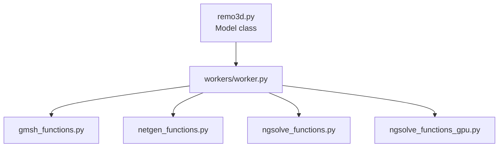

# Project Overview and Architecture

## 1.1 Overall Structure

ReMo3D is organized around one orchestration class, `remo3d.Model`, plus four
backend layers:

1. tool parsing and model setup in `remo3d/remo3d.py`
2. mesh-window selection and geometry construction in
   `remo3d/netgen_functions.py` and `remo3d/gmsh_functions.py`
3. FEM assembly and linear solves in `remo3d/ngsolve_functions.py` and
   `remo3d/ngsolve_functions_gpu.py`
4. distributed execution in `remo3d/workers/worker.py`

The `Model` class owns:

- parsed tool definitions in `self.tools`
- formation data in `self.formation_model`
- borehole data in `self.borehole_model`
- dip values in degrees and radians
- worker configuration and the MPI intercommunicator
- final output logs in `self.logs`

The master process controls the workflow, while worker processes do the local
geometry clipping, meshing, FEM solve, and apparent-resistivity evaluation.

## 1.2 Data Flow

```mermaid
flowchart LR
    A[User input]
    B[Model.__init__\nTool parsing]
    C[Model.set_model_parameters\nLoad and validate]
    D[Model.initialize_workers\nSpawn MPI workers]
    E[Model._prepare_simulation_depths_and_tasks]
    F[Master broadcast]
    G[Worker data clipping]
    H[Mesh generation]
    I[SolveBVP]
    J[Potential evaluation]
    K[Master gather]
    L[save_results]

    A --> B --> C --> D --> E --> F --> G --> H --> I --> J --> K --> L
```

Operationally the pipeline is:

1. parse tool strings into geometry, source terms, geometric factor, and depth
   shift
2. load or accept the formation and borehole arrays
3. spawn workers and assign each worker to CPU or GPU execution
4. convert measurement depths into simulation depths and batches
5. broadcast the model and task list
6. let workers pull tasks dynamically
7. mesh and solve locally for each task
8. gather apparent resistivity values and write output files and plots

## 1.3 Module Dependency Graph

### External-library map

| Module | Internal dependencies | External dependencies |
| --- | --- | --- |
| `remo3d.py` | spawns `workers/worker.py` through MPI | `mpi4py`, `matplotlib`, `numpy`, `scipy.interpolate`, standard library |
| `gmsh_functions.py` | `ReadGmsh` is consumed by the worker pipeline | `gmsh`, `numpy`, `scipy.interpolate`, `netgen.meshing` |
| `netgen_functions.py` | none | `numpy`, `netgen.geom2d`, `netgen.csg`, `netgen.meshing` |
| `ngsolve_functions.py` | `AddPointSource` is reused by the GPU solver | `numpy`, `ngsolve` |
| `ngsolve_functions_gpu.py` | imports `AddPointSource` from `ngsolve_functions.py` | `numpy`, `ngsolve`, `ngsolve.ngscuda` |
| `workers/worker.py` | imports the mesh and solver modules | `mpi4py`, `numpy`, `ngsolve`, standard library |

### Runtime responsibility split

- `remo3d.py` owns the public API, validation, batching, and output assembly.
- `gmsh_functions.py` handles 2D and 3D Gmsh-based mesh generation plus `.msh`
  parsing back into Netgen mesh objects.
- `netgen_functions.py` is the default 2D backend.
- `ngsolve_functions.py` and `ngsolve_functions_gpu.py` assemble and solve the
  PDE.
- `workers/worker.py` binds the backends into the MPI task loop.

## 1.4 Glossary

| Term | Meaning in ReMo3D |
| --- | --- |
| normal log | A resistivity tool geometry with one current electrode and one or two nearby potential electrodes. |
| lateral log | The same parser and solver path as normal tools, but with larger electrode spacings. |
| resistivity | Electrical resistivity in ohm-meters (`OHMM` in files). |
| conductivity | Reciprocal of resistivity. The solver uses conductivity and stores it as `sigma`. |
| formation | The layered rock model outside the borehole. |
| filtration zone | The invaded near-well zone, represented by `FZ_RADIUS` and `FZ_VALUE`. |
| undisturbed zone | The part of the layer outside the filtration zone, represented by `UZ_VALUE`. |
| mud resistivity | Resistivity of drilling fluid inside the borehole. |
| caliper | Borehole diameter measurement. File column `CALM`; stored internally as radius. |
| dip angle | Angle controlling whether the problem stays axisymmetric (`dip=0`) or becomes a 3D dipping model (`dip!=0`). |
| geometric factor | Tool-specific scalar that converts computed potential into apparent resistivity. |
| electrode configuration | Tool string such as `B5.7A0.4M` describing electrode order and spacing. |
| BVP | Boundary value problem for the electric potential. |
| preconditioner | The NGSolve preconditioner passed to `ngs.Preconditioner`. |
| static condensation | Elimination of element-internal unknowns from the global system. |
| SEC mode | Single-electrode computation mode. Several tools can share one solve if they use the same single current electrode. |
| batch mode | Grouping adjacent simulation depths into one worker task. |
| simulation depth | Depth at which the PDE is solved after applying a tool-specific depth shift. |
| measurement depth | Depth attached to the final log sample written to `self.logs`. |
## See Also
- [model-api.md](model-api.md#31-model__init__): how the architecture is exposed through the public API.
- [parallel-execution.md](parallel-execution.md#71-worker-process-lifecycle): the worker-side view of the same control flow.
- [mesh-generation.md](mesh-generation.md#4-mesh-generation---gmsh-gmsh_functionspy): geometry backends referenced in the module graph.
