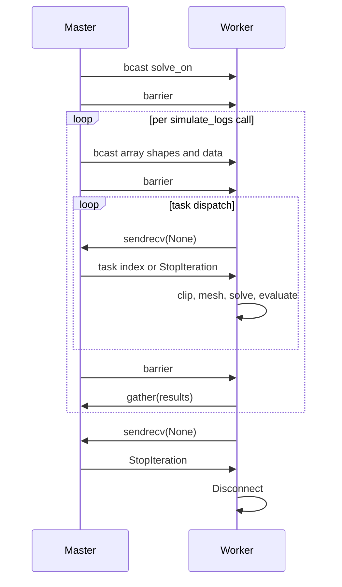

# Parallel Execution

## 7.1 Worker Process Lifecycle

Each worker starts by connecting to its parent MPI communicator:

1. `MPI.Comm.Get_parent()`
2. `rank = comm.Get_rank()`
3. receive the `solve_on` list from the master
4. choose the CPU or GPU solve module
5. enter the outer task loop
6. for each outer-loop iteration, receive one full batch configuration
7. enter the inner task loop and process task indices on demand
8. gather results back to the master
9. break when `StopIteration` is received and disconnect

The worker therefore has two nested lifecycles:

- a setup-and-broadcast lifecycle per simulation call
- a task-execution lifecycle per batch index within that call

## 7.2 MPI Communication Protocol

The communication pattern is split by message type.

### Global setup

- `comm.bcast(solve_on, root=0)`
- `comm.barrier()`

### Broadcasted batch configuration

The master sends array shapes first, then the raw arrays, then scalar and Python
container metadata.

Broadcast payload:

- `arrays_shape`
- `formation_parameters`
- `borehole_geometry`
- `mud_resistivities`
- `simulation_depths`
- `dip`
- `tools_parameters`
- `domain_radius`
- `mesh_generator`
- `preconditioner`
- `condense`
- `task_list`

Mechanisms used:

- `comm.bcast` for Python objects and scalars
- `comm.Bcast` for contiguous numeric arrays
- `comm.barrier` to synchronize before task dispatch and before gather

### Task dispatch

The worker repeatedly calls:

```python
comm.sendrecv(None, dest=0)
```

and the master responds with either:

- an integer task index
- `StopIteration`

### Result collection

When the inner loop finishes, each worker sends its `results` list with:

```python
comm.gather(sendobj=results, root=0)
```

## 7.3 Two-Level Task Loop and Sentinel Pattern

The worker contains two nested iterator loops of the form:

```python
for msg in iter(lambda: comm.sendrecv(None, dest=0), StopIteration):
    ...
```

Meaning:

- outer loop: one iteration per simulation call and broadcasted configuration
- inner loop: one iteration per task index inside that simulation call

The `StopIteration` object is used as the sentinel in both loops. That keeps the
protocol simple:

- outer `StopIteration`: end the worker process
- inner `StopIteration`: end the current batch of task indices and move to gather

## 7.4 Per-Task Worker Pipeline

For every task index received from the master, the worker does:

1. read the corresponding task entry from `task_list`
2. choose the active `tool_geometry` and `source_terms`
3. select the local data window and conductivity distribution
4. build the local mesh with Gmsh or Netgen
5. wrap the mesh as `ngs.Mesh(mesh)`
6. wrap the conductivity list as `ngs.CoefficientFunction(sigma)`
7. loop through the local modelling subtasks
8. solve one BVP per unique current-electrode configuration
9. evaluate the potential at the measurement electrodes
10. multiply by the geometric factor and append the result triplet

This is where the SEC optimization pays off: the inner measurement loop can
re-use one solved potential field for several tool outputs.

## 7.5 Error Handling

The per-task logic is wrapped in a broad `try/except` block.

If anything in the local task fails, including:

- geometry clipping
- meshing
- mesh conversion
- FEM solve
- point evaluation

then the worker appends `np.nan` for every measurement associated with that
failed task.

Implications:

- the full run can finish even when some local tasks fail
- failures are converted into missing values instead of immediate exceptions
- silent fallback to `NaN` is convenient for large batches, but it can also hide
  the root cause unless worker logs are inspected separately

## 7.6 Dynamic Load Balancing

The master does not pre-assign a static chunk of task indices to each worker.
Instead it uses:

```python
self.comm.recv(source=MPI.ANY_SOURCE, status=status)
self.comm.send(obj=msg, dest=status.Get_source())
```

That means any worker that becomes free first receives the next task.

Why this matters:

- local meshes vary in complexity
- 3D tasks can be much more expensive than 2D tasks
- conductivity contrasts and batch contents change solve cost

The on-demand scheduling therefore gives better utilization than equal-size
static partitioning.

## Sequence View


