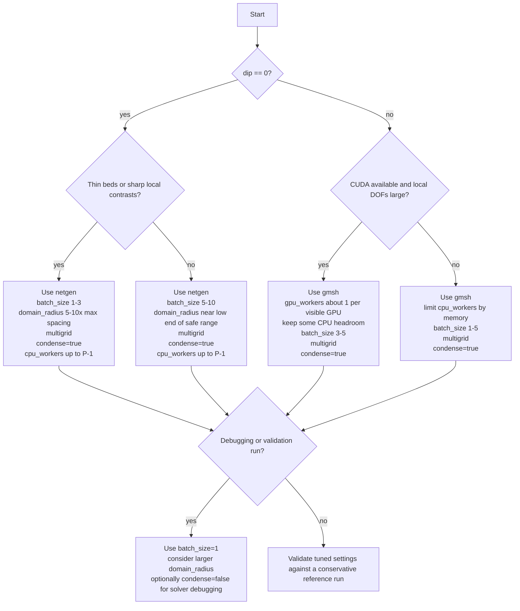

# Performance and Optimization Guide

This page turns the runtime knobs in [`configuration.md`](configuration.md) into
workload-level guidance. In the current implementation, most wall time is spent
in local geometry selection, mesh generation, finite-element assembly, and CG
solves. Task preparation and MPI coordination matter, but they are usually not
the dominant cost once the run is large enough to be interesting.

## 19.1 CPU Parallelism

### 19.1.1 MPI execution model

`initialize_workers` spawns `cpu_workers + gpu_workers` child ranks. The master
process stays on the original rank and only:

- prepares batches and task lists
- broadcasts geometry, tool, and solver metadata
- dispatches task indices
- gathers results
- prints progress and total runtime

All mesh generation and all calls to `SolveBVP` happen inside
[`workers/worker.py`](../remo3d/workers/worker.py).

If the machine has `P` physical CPU cores and the run uses CPU workers only, a
practical upper bound for useful CPU concurrency is:

```math
n_{\mathrm{eff}} \approx \min(\texttt{cpu\_workers}, P - 1)
```

because the master still occupies one core for coordination. Hyper-threading can
help a little, but once meshing and sparse linear algebra saturate memory
bandwidth the gain is usually smaller than the raw logical-core count suggests.

### 19.1.2 Scaling guidelines

Expected scaling behavior:

- close to linear while workers stay busy, memory is available, and the run has
  enough tasks to amortize startup cost
- diminishing returns once worker count approaches the number of useful cores
- little benefit from extra workers on very short 2D runs where fixed overhead
  dominates

Main overhead sources:

- MPI process spawning
- the one-time `solve_on` broadcast
- per-run broadcasts of arrays and metadata
- barriers before task dispatch and before gather
- the per-task request/reply handshake with the master
- final result gathering and sorting

How to find the sweet spot on a given machine:

1. choose one representative case
2. run it with `cpu_workers = 1, 2, 4, ...`
3. record the final `Processed in:` time
4. stop increasing workers once the improvement between steps falls below about
   `5-10%`
5. back off if the machine starts paging or becomes unresponsive

For 2D runs, the best worker count is often "as many cores as possible minus
one". For 3D runs, memory pressure can become the limiting factor first.

### 19.1.3 Dynamic load balancing

Workers pull tasks on demand. Each worker repeatedly calls:

```python
comm.sendrecv(None, dest=0)
```

and the master answers whichever rank becomes free first via
`recv(source=MPI.ANY_SOURCE)`.

This matters because local task cost is not uniform:

- some batches create more complicated meshes
- 3D tasks are much more expensive than 2D tasks
- strong conductivity contrasts can increase CG work
- mixed CPU/GPU pools have intentionally heterogeneous worker speed

A static partition would leave fast workers idle while one slow worker finishes
the hardest batch. The pull-based scheduler reduces that tail effect.

### 19.1.4 Memory considerations

Every worker receives full copies of the broadcasted model data:

- `formation_model`
- clipped borehole geometry array
- interpolated mud-resistivity array
- combined simulation-depth array
- `task_list`
- `tools`

Those broadcast objects are usually small compared with the per-worker local
solve state. Memory is dominated by:

- the clipped mesh
- the order-3 `H1` finite-element space
- the assembled stiffness matrix
- the preconditioner
- grid functions and Krylov vectors
- for GPU runs, device copies of the matrix, preconditioner, and load vector

Rule-of-thumb memory budget per worker:

| Case | Rough worker memory |
| --- | --- |
| routine 2D axisymmetric | `20-150 MB` |
| large or heavily refined 2D | `100-300 MB` |
| moderate 3D | `0.3-1.5 GB` |
| large 3D / aggressive refinement | `1-4+ GB` |

These are order-of-magnitude planning numbers, not hard guarantees. In practice,
memory often becomes the bottleneck before CPU count on 3D runs. On a `32 GB`
workstation, many 2D workers may fit comfortably, while 3D runs often top out
at only a few concurrent workers.

## 19.2 GPU Acceleration

### 19.2.1 When the GPU path helps

The GPU solver path keeps the PDE formulation unchanged but moves the linear
solve to CUDA after assembly:

```python
adev = a.mat.CreateDeviceMatrix()
cdev = c.mat.CreateDeviceMatrix()
fdev = f.vec.CreateDeviceVector(copy=True)
inv = ngs.CGSolver(adev, cdev, maxsteps=1000, printrates=False)
```

Important implication: mesh generation, FE-space construction, bilinear-form
assembly, and point-source assembly still happen on the CPU. The GPU only helps
when the CG phase is a large enough fraction of total runtime to amortize device
setup and data transfer.

Practical consequence:

- large 3D models often benefit
- small 2D axisymmetric models often do not

### 19.2.2 Configuring GPU workers

Set `gpu_workers=N` in `initialize_workers` or in
`Model.compute_synthetic_logs(...)`.

The master builds:

```python
solve_on = ["CPU"] * cpu_workers + ["GPU"] * gpu_workers
```

CPU and GPU workers then pull from the same task queue. This means:

- CPU and GPU workers can run simultaneously in one simulation
- the scheduler naturally feeds the next free worker, regardless of type
- if multiple GPU workers target the same physical device, they will contend for
  it because the current code does not pin workers to devices explicitly

A safe starting point is one GPU worker per visible GPU.

### 19.2.3 Hardware requirements and fallback behavior

The current CUDA availability check is:

```python
try:
    import ngsolve.ngscuda
except:
    print("No CUDA library or device available. The number of gpu processes is set to 0")
    gpu_workers = 0
```

Requirements:

- a CUDA-capable GPU
- an NGSolve build with CUDA support
- a Python environment where `ngsolve.ngscuda` imports successfully on the
  machine that will spawn the workers

If CUDA is unavailable, ReMo3D does not abort. It prints a warning and falls
back to `gpu_workers = 0`.

### 19.2.4 CPU versus GPU decision guidance

Rule-of-thumb decision table:

| Local FE problem size | Likely better choice |
| --- | --- |
| below `50k` DOFs | CPU |
| roughly `50k-200k` DOFs | benchmark both |
| above the low hundreds of thousands of DOFs | GPU is worth trying |

Interpretation:

- most 2D axisymmetric jobs stay in the CPU-favored regime
- many 3D dipping-layer jobs move into the "benchmark both" or GPU-favored
  regime
- if meshing dominates, GPU acceleration will not move the total wall time much
  even when the solve itself is faster

The exact crossover depends on the GPU model, PCIe bandwidth, the chosen
preconditioner, and how expensive the local mesh is.

### 19.2.5 Multi-GPU setups and current limitations

The current code imports the CUDA solver path but does not choose a GPU device
per worker rank. All GPU workers inherit whatever CUDA visibility the parent
process had.

Current limitation:

- there is no explicit in-code mapping from worker rank to GPU id

Practical workarounds:

- expose only the devices you want the run to see with `CUDA_VISIBLE_DEVICES`
- if your MPI launcher supports per-rank environment variables, use a wrapper to
  give different workers different visible devices
- otherwise prefer one GPU worker per run, or one GPU worker per visible device
  when you can control rank placement outside ReMo3D

`CUDA_VISIBLE_DEVICES` controls visibility, not ownership. If two workers can
see the same device, they may still share it.

## 19.3 Batch Size Tuning

### 19.3.1 Detailed batch mechanism

`_prepare_simulation_depths_and_tasks` implements batching in three steps:

1. build the per-tool simulation-depth list
2. reshape it into batches of size `batch_size`
3. replace each batch by one representative depth

The code computes:

```python
combined_simulation_depths = np.round(np.nanmean(simulation_depths, axis=1), decimals=4)
simulation_offsets = np.round(simulation_depths - combined_simulation_depths[:, None], decimals=4)
```

Interpretation:

- one mesh is generated for the batch-average depth
- individual measurements inside the batch are shifted by `simulation_offset`
- batching therefore removes redundant mesh generation for nearby depths
- batching does not remove the need to solve each distinct current-electrode
  configuration inside the batch

When SEC is active, the batch reuses one mesh for all SEC-compatible tools at
nearby depths. When SEC is inactive, batching still saves mesh builds, but the
solver has to work through more per-tool subtasks.

### 19.3.2 Accuracy versus speed tradeoff

The approximation introduced by batching is geometric rather than algebraic: a
measurement may be evaluated on a mesh centered at a nearby depth instead of the
exact local center.

For evenly spaced samples with depth step `dz` and batch size `B`, the exact
maximum depth offset inside one full batch is:

```math
|\Delta z|_{\max} = \frac{(B - 1)dz}{2}
```

The simpler estimate `B*dz/2` is a conservative rule of thumb.

Why the offset matters:

- thin beds can move noticeably relative to the local mesh center
- sharp invaded-zone boundaries can be represented at slightly shifted positions
- strong borehole-geometry variation inside a batch makes the average mesh less
  representative

If the model varies slowly compared with tool spacing, the batching error is
usually small and the speedup is worth it.

### 19.3.3 Batch-size recommendations

Recommended starting points:

| Goal | Suggested `batch_size` | When to use it |
| --- | --- | --- |
| maximum fidelity | `1` | thin beds, sharp contrasts, debugging, reference runs |
| balanced default | `5` | most routine production runs |
| fast reconnaissance | `10-20` | smooth models, quick sensitivity scans, coarse screening |

Example with `dz = 0.1 m`:

- `batch_size = 5`: exact max offset `0.2 m`; conservative quick estimate
  `~0.25 m`
- `batch_size = 10`: exact max offset `0.45 m`; conservative quick estimate
  `~0.5 m`

Always relate `batch_size` to the physical scale of the features you care about.
A `0.5 m` batching offset may be harmless in a smooth thick-bed model and too
large in a thin-bedded invasion case.

### 19.3.4 Interaction with SEC

SEC and batching accelerate different parts of the workflow:

- SEC reduces the number of BVP solves
- batching reduces the number of meshes that have to be generated

Illustrative workload count for `6` SEC-compatible tools and `100` measurement
depths:

| Mode | Mesh builds | BVP solves | Final tool evaluations |
| --- | --- | --- | --- |
| no SEC, `batch_size=1` | `600` | `600` | `600` |
| SEC, `batch_size=1` | `100` | `100` | `600` |
| SEC, `batch_size=5` | `20` | `100` | `600` |
| SEC, `batch_size=10` | `10` | `100` | `600` |

Wall time often tracks this table qualitatively because mesh generation and the
BVP solve dominate most runs.

## 19.4 Domain Radius Impact

### 19.4.1 Why `domain_radius` affects accuracy

ReMo3D truncates an unbounded resistivity problem to a finite circular or
half-spherical domain and applies `u = 0` on the outer boundary. That is only a
good approximation when the boundary is far enough from the electrodes and the
main conductivity contrasts.

If the domain is too small:

- the Dirichlet boundary artificially damps the potential field
- apparent-resistivity values pick up systematic truncation error
- long-spacing tools are affected first because their current flow reaches
  farther into the model

### 19.4.2 Practical radius guidelines

A good default rule is:

```math
\texttt{domain\_radius} \gtrsim 5\text{ to }10 \times \text{(largest electrode spacing)}
```

The shipped default `50 m` is generous for typical short- and medium-spacing
normal/lateral tools in the `0.1-6 m` range.

Master-side checks in `simulate_logs`:

- if any electrode lies outside the domain, the run aborts
- if any electrode exceeds `0.75 * domain_radius`, the code prints a warning

That `75%` warning is a useful early sign that the truncation radius is getting
aggressive.

### 19.4.3 Performance cost of larger domains

Larger domains increase:

- the amount of local geometry included in clipping
- mesh element count
- FE-space size
- matrix assembly cost
- CG solve cost

Scaling intuition:

- in 2D, local area grows roughly like `r^2`
- in 3D, local volume grows roughly like `r^3`

That is why `domain_radius` is one of the most important performance knobs in 3D.
A modest accuracy-driven radius increase can translate into a much larger mesh
and much longer solve time.

## 19.5 Mesh Generator Choice

### 19.5.1 Netgen versus Gmsh for 2D performance

For 2D axisymmetric models, `mesh_generator="auto"` chooses Netgen for a reason.

Netgen advantages in 2D:

- direct `SplineGeometry` construction
- no OCC boolean-operation overhead
- no temporary `.msh` write/read cycle
- usually the lowest meshing latency for routine 2D jobs

Gmsh costs more in 2D because it:

- builds the geometry with OCC boolean operations
- generates the mesh through Gmsh's mesher
- writes a temporary `.msh` file
- reads that file back through `ReadGmsh`

For routine 2D work, the meshing portion is often around `2x` faster with
Netgen and can be several times faster on simple models. The exact factor
depends on layer count, invasion geometry, and local refinement.

### 19.5.2 Why Gmsh is required for 3D

Netgen's `SplineGeometry` path is 2D-only. ReMo3D's 3D models need:

- half-sphere domain construction
- revolved borehole geometry
- rotated boxes for dipping layers
- cylinder intersections for invaded zones
- 3D boolean cuts and intersections

Those operations are implemented in `ConstructGmsh3dModel`, so `gmsh` is the
only supported 3D backend.

### 19.5.3 Temporary-file overhead

The Gmsh builders write meshes to `./tmp/` as `fm_<rank>.msh`, then re-read them
through `ReadGmsh` into a Netgen-compatible mesh object. That means Gmsh has an
extra filesystem round trip that Netgen avoids.

Practical implications:

- slow local disks or network filesystems can make Gmsh noticeably slower
- very small Gmsh tasks suffer more from this fixed overhead than long 3D tasks
- the code removes `./tmp/` at the end of a successful `simulate_logs` call

If a run is interrupted abruptly, leftover temporary files may remain until they
are deleted manually.

## 19.6 Solver Parameters

### 19.6.1 Preconditioner performance

Current choices:

- `"multigrid"` (default)
- `"local"`

Practical comparison:

| Preconditioner | Typical behavior |
| --- | --- |
| `multigrid` | more setup work, but usually much lower CG iteration counts and better scaling with mesh refinement |
| `local` | simpler and sometimes acceptable on small problems, but iteration counts usually grow faster as the mesh gets larger or more irregular |

For elliptic resistivity problems, `multigrid` is the right default. A useful
rule of thumb is:

- `multigrid`: often converges in tens to low hundreds of iterations on routine
  problems
- `local`: may stay acceptable on small 2D jobs but can drift into the high
  hundreds on refined or 3D cases

Exact counts depend strongly on conductivity contrast, mesh quality, and domain
size.

### 19.6.2 Impact of `condense=True`

The solver builds the bilinear form with:

```python
a = ngs.BilinearForm(fes, symmetric=True, condense=condense)
```

With order-3 elements, static condensation removes many element-internal DOFs
from the global linear solve. A rough planning number is a `50-70%` reduction in
global system size compared with the fully assembled order-3 system.

Practical consequences:

- smaller global linear system
- lower memory pressure in the global solve
- faster CG in many cases
- mathematically equivalent final solution after harmonic-extension and
  `inner_solve` reconstruction

Leave `condense=True` on unless you are debugging solver internals or comparing
assembly strategies.

### 19.6.3 The hardcoded `maxsteps=1000`

Both CPU and GPU solver paths hardcode `maxsteps=1000`.

What that means:

- well-conditioned 2D problems usually have ample headroom
- large 3D problems, especially with `preconditioner="local"`, may get close to
  the limit
- the current implementation does not check or print a convergence flag after CG

So if the limit is hit, the solver still returns the current iterate and the run
continues silently.

How to detect a likely limit hit:

- compare the same case under `"multigrid"` and `"local"`
- rerun with a smaller `batch_size` or larger `domain_radius` and look for
  unstable apparent-resistivity changes
- add residual monitoring, as shown in
  [`developer-guide.md`](developer-guide.md#105-modifying-the-solver), when you
  need a definitive answer

## 19.7 Single-Electrode Computation Mode (SEC)

### 19.7.1 Performance effect of SEC

When SEC is available, ReMo3D solves one BVP per simulation depth instead of one
BVP per tool per simulation depth. The worker can then evaluate multiple tool
responses from the same solved potential field.

If `N` tools all share a compatible single-current-electrode structure, the FE
solve count can drop by up to a factor of `N`.

This is one of the highest-impact optimizations in the current code because the
BVP solve is usually one of the dominant runtime components.

### 19.7.2 `force_single_electrode_configuration=True`

The default tool parser rewrites any valid three-electrode tool that contains
both `A` and `B` by swapping electrode roles with:

```python
tool.translate(str.maketrans("ABMN", "MNAB"))
```

That converts dual-current configurations into equivalent single-current ones so
that SEC can stay active.

Why this is exact rather than approximate:

- the rewrite relies on electrode reciprocity, not on numerical fitting
- the geometric factor is recomputed for the converted tool
- the resulting apparent resistivity is mathematically identical for the valid
  three-electrode tool families supported by ReMo3D

### 19.7.3 When SEC cannot be used

In the current three-electrode implementation, SEC is unavailable mainly in two
situations:

- `force_single_electrode_configuration=False` and at least one tool is from an
  `ABM` or `ABN` family, meaning it keeps two current electrodes in the local
  solve
- a future extension introduces tool families that are not covered by the
  current three-electrode rewrite logic

With the default `force_single_electrode_configuration=True`, all valid current
three-electrode tool families are rewritten into SEC-compatible form before task
preparation. Invalid tool patterns do not disable SEC; they raise a
`ValueError` earlier during tool parsing.

## 19.8 End-to-End Performance Profiles

### 19.8.1 Typical 2D wall-time profile

Order-of-magnitude wall-time split for a routine 2D run:

| Phase | Typical share |
| --- | --- |
| task preparation and sorting | `1-5%` |
| MPI setup, broadcast, dispatch, gather | `5-10%` |
| mesh generation | `35-55%` |
| FEM assembly | `10-20%` |
| CG solve | `20-40%` |
| point evaluation and result formatting | `<10%` |

The dominant cost is usually mesh generation plus the solve.

### 19.8.2 Typical 3D wall-time profile

Order-of-magnitude wall-time split for a routine 3D run:

| Phase | Typical share |
| --- | --- |
| task preparation and sorting | `1-3%` |
| MPI setup, broadcast, dispatch, gather | `3-8%` |
| mesh generation | `25-45%` |
| FEM assembly | `10-20%` |
| CG solve | `35-55%` |
| point evaluation and result formatting | `<5%` |

The project README states that on an AMD Ryzen 2600 class machine, a moderate
single-tool run with `100` measurement points takes roughly:

- `15-30 s` in 2D
- `15-30 min` in 3D

That gap is consistent with the code structure: 3D meshing and 3D linear solves
are both much more expensive than their 2D counterparts.

### 19.8.3 Decision flowchart



Compact recommendation table:

| Scenario | Recommended settings |
| --- | --- |
| routine 2D production | `mesh_generator="netgen"`, `batch_size=5`, `preconditioner="multigrid"`, `condense=True` |
| high-fidelity 2D thin beds | `batch_size=1-3`, conservative `domain_radius`, keep `multigrid` |
| moderate 3D without CUDA | `mesh_generator="gmsh"`, moderate `cpu_workers`, memory-aware scaling, `batch_size=1-5` |
| large 3D with CUDA | `mesh_generator="gmsh"`, `gpu_workers` about one per visible GPU, moderate `cpu_workers`, `condense=True` |
| debugging solver behavior | `batch_size=1`, possibly larger `domain_radius`, compare preconditioners, optionally disable condensation temporarily |

### 19.8.4 Performance anti-patterns

Common mistakes that slow runs down unnecessarily:

- `batch_size=1` for dense depth sampling when the model is actually smooth
- an excessively large `domain_radius` for short-spacing tools
- `cpu_workers` far above the number of useful cores
- too many workers for available RAM on 3D jobs
- forcing `gmsh` for routine 2D work when Netgen is sufficient
- trying multiple GPU workers against one physical GPU without device control
- using `preconditioner="local"` on large refined meshes without benchmarking
- disabling `condense` for production runs
- assuming the GPU will help when the run is dominated by meshing rather than
  the linear solve

## See Also

- [`configuration.md`](configuration.md#91-compute_synthetic_logs-parameter-reference): definition of the public runtime knobs discussed here.
- [`parallel-execution.md`](parallel-execution.md#76-dynamic-load-balancing): worker scheduling and the MPI protocol behind throughput scaling.
- [`solver.md`](solver.md#66-cg-convergence-behavior): convergence, preconditioner behavior, and the `maxsteps=1000` limit.
- [`model-api.md`](model-api.md#312-_prepare_simulation_depths_and_tasks): the batching and SEC task structures used by the master.
- [`examples-and-tutorials.md`](examples-and-tutorials.md#148-performance-tuning-guide): short usage-oriented tuning notes.
