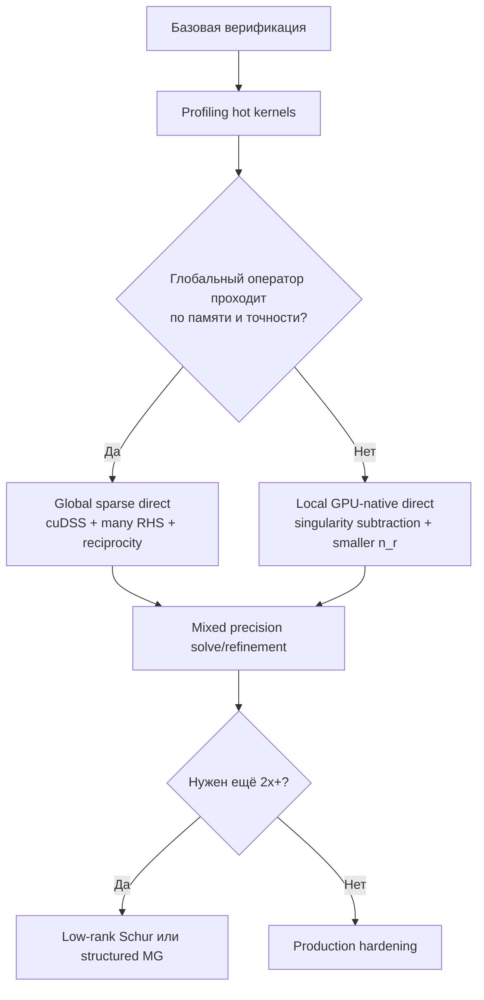

# GPU-first решатель для осесимметрической задачи потенциала

## Executive summary

Текущий потолок около **5× на RTX A6000** я бы не трактовал как аппаратный предел. Это почти наверняка потолок **конкретной комбинации**: локальные окна, устранение по слоям, маленькие плотные Schur-блоки порядка ~\(10^2\), стандартные batched factorization kernels и неполное скрытие латентности. NVIDIA прямо показывает, что правильная диагностика тут делается через `SpeedOfLight`, `Occupancy`, `SchedulerStats`, `WarpStateStats` и PC-sampling, а не по одному числу GFLOP/s; высокая доля пропущенных issue-slots и большой разрыв между теоретической и достигнутой occupancy означают проблему латентности и/или дисбаланса, а не «жёсткую стену железа». citeturn5search2turn5search5turn23search0turn23search3

Если цель — **действительно драматическое ускорение**, оптимизировать только текущий batched block-Thomas недостаточно. Наилучшие шансы дают две линии, которые нужно вести параллельно. Первая — **убрать сам источник потолка**, то есть перейти от «много локальных факторизаций» к **одной глобальной факторизации + множеству RHS**, с повторным использованием факторов, множественными RHS и, где применимо, reciprocity. Для такого режима у NVIDIA уже есть подходящий стек: `cuDSS` поддерживает analysis/factorization/solve, refactorization, multiple RHS, batching и Schur complement mode; старый `cuSolverRF` специально создан для последовательностей матриц с одним и тем же sparsity pattern. Вторая линия — если локальная стратегия всё же остаётся оптимальной по физике и памяти, то её надо переписать как **device-resident structured direct solver**, где сингулярность источника снята аналитически, \(n_r\) уменьшен за счёт лучшей аппроксимации у электрода, а batched `potrf/trsm/syrk` заменены на persistent kernels, смешанную точность и refinement. citeturn12search0turn12search2turn11search0turn11search2turn7search7turn14search6

Мой практический вывод жёсткий: **ставка номер один — глобальный оператор с амортизацией факторизации по многим положениям прибора**. Если эта ветка проходит по памяти и не ломает точность на граничных условиях, она может дать не косметическое, а именно **смену режима производительности**. Если же глобальная ветка не проходит, то в локальной ветке главный выигрыш придёт не от ещё одного library swap, а от **сочетания** трёх вещей: singularity subtraction, уменьшение \(n_r\), и custom/persistent batched small-matrix kernels. Именно это сочетание, а не CUDA Graphs сами по себе, реально способно пробить текущий потолок. CUDA Graphs уменьшают host launch overhead, но не устраняют низкую утилизацию вычислительных ядер и последовательные зависимости внутри маленьких factorization kernels. citeturn19search7turn6search0turn8search0turn8search4

Ниже я исхожу из открытых допущений: допустимая точность должна быть не хуже текущей production-точности, бюджет разработки открыт, а нынешний потолок ~5× на RTX A6000 принимается как входной факт задачи.

## Где на самом деле возникает текущий потолок

У такой задачи есть неудобный для GPU профиль. Плотные Cholesky/LU/SYRK/TRSM для **малых матриц** известны как отдельный класс нагрузок, для которого нужны специализированные batched BLAS/LAPACK kernels; MAGMA много лет показывает, что именно для small-matrix workloads нужны отдельные дизайны и autotuning, и что naїve library paths нередко оставляют значительную производительность на столе. CUTLASS аналогично вводит **grouped persistent kernels** именно потому, что обычный one-kernel-per-problem режим плохо балансирует наборы многих небольших задач. citeturn8search0turn8search4turn8search7turn6search0

Но даже очень хороший batched dense kernel не отменяет главной проблемы текущей математики. Если стоимость доминирует в факторизации Schur-блоков размера \(n_r\times n_r\), то локальный direct path масштабируется примерно как \(O(n_z\,n_r^3)\). Это означает, что даже умеренное сокращение радиального размера даёт непропорционально большой эффект: уменьшение \(n_r\) на 20% даёт почти двукратное падение кубического доминанта. Именно поэтому «ускорять только kernel» и «ускорять algorithmic shape of the local system» — это совершенно разные классы выигрыша. Низкоуровневый тюнинг обычно даёт десятки процентов или единицы раз; уменьшение effective \(n_r\) меняет ведущую сложность. citeturn13search1turn13search7

Называть такой режим «compute-bound» до профилирования нельзя. NVIDIA в документации Nsight Compute прямо связывает низкое число eligible warps, пропуски issue slots, низкую achieved occupancy и доминирующие stall states с плохим скрытием латентности и дисбалансом. Для реального compute-bound ядра вы хотите видеть высокую утилизацию SM pipelines и/или памяти на шкале `SpeedOfLight`; для memory-bound — высокий `dram__throughput`; для latency-bound — много `long_scoreboard`, `short_scoreboard`, `wait`, `lg_throttle`, низкие eligible warps и дырки в issue. До такого замера тезис про «hard ceiling» — преждевременный. citeturn23search0turn23search3turn22search0turn22search2turn22search4

Практически это означает следующее. Если Nsight покажет **низкий** `sm__throughput.avg.pct_of_peak_sustained_elapsed` и одновременно **низкий** `dram__throughput.avg.pct_of_peak_sustained_elapsed`, то вы вообще не упираетесь ни в compute peak, ни в memory bandwidth; вы упираетесь в малозадачность, сериализацию и/или layout. Если же `smsp__pcsamp_warps_issue_stalled_long_scoreboard` будет велик, проблема в глобальной памяти/L1TEX и раскладке данных. Если велик `smsp__pcsamp_warps_issue_stalled_short_scoreboard`, ищите shared-memory bank conflicts, мелкие MIO-операции и слишком частые синхронизации. Только если `Math Pipe Throttle` высок, issue efficiency высока и SOL по вычислительным пайпам уже близок к насыщению, можно говорить о настоящем compute wall. citeturn21search1turn22search2turn22search4turn23search7

## Математические рычаги, которые меняют сложность

Модель сама подсказывает первый большой рычаг: **сингулярный источник нельзя оставлять “как есть”**, если вы хотите радикально сокращать локальное разрешение. Для эллиптических задач с точечным источником стандартный ход — разложение
\[
u = G + v,
\]
где \(G\) — известная аналитическая сингулярная часть, а \(v\) — более гладкое остаточное поле. Современная литература по singular-source Poisson прямо использует фундаментальное решение Лапласа для выделения сингулярной части; для задач с геоэлектрической спецификой полезна и более богатая опора — аналитическая/полуаналитическая Green’s part для горизонтально-слоистого фона, поскольку вблизи оси и источника именно она стабилизирует вычисление лучше всего. В weighted setting для Dirac sources это не просто трюк, а естественная функциональная постановка. citeturn7search7turn7search0turn14search6

Для вашей задачи это означает очень конкретную инженерную возможность. Если вынести в \(G\) хотя бы **однородный** или **локально-слоистый** вклад около электрода, остаток \(v\) становится гораздо более гладким по \(r\). Тогда становится возможным одновременно: уменьшить число радиальных узлов возле источника, ослабить требования к локальному сгущению, и перенести значительную часть «тяжёлой физики» из GPU-солвера в дешёвую аналитическую коррекцию. Это почти всегда лучший первый шаг, чем прямой переход к более экзотическим solver ideas. citeturn7search7turn14search6turn18search3turn18search4

Второй рычаг — **дискретизация у скважины**. Для structured FV на стандартном 5-точечном stencil межслойные блоки при упорядочении по \(z\)-слоям естественно остаются очень простыми; для tensor-product Q1 на четырёхугольниках межслойная связь уже шире. Но в обоих случаях устранение слоёв быстро делает Schur-блоки плотными. Хорошая новость в том, что для дискретизаций эллиптических PDE офф-диагональные блоки Schur complements часто имеют **низкий численный ранг**; это и есть теоретическая основа для HSS/HODLR/BLR-ускорений. Плохая новость в том, что если вы не используете эту структуру, то Schur step просто превращает «почти разреженную» задачу в серию обычных маленьких dense factorizations — самый невыгодный режим для Ampere. citeturn13search1turn13search7turn3search1turn3search7

Третий рычаг — **локальная высокая точность вместо глобально мелкой сетки**. Для well-like singular behaviour в литературе давно используются logarithmic/enriched finite elements и singular-function enrichment, именно чтобы правильно передавать логарифмический или фундаментально-сингулярный профиль без тотального сгущения. Для вас это означает не обязательно переход на «чистый» high-order FEM по всей области; более реалистичен гибрид: обычная structured сетка + несколько специальных радиальных слоёв/базисов около источника + стандартная аппроксимация вдали. Такой гибрид намного благоприятнее для GPU, чем полноценный unstructured high-order mesh, и при этом может убрать десятки процентов из \(n_r\). citeturn18search1turn18search3turn18search4turn18search10

Четвёртый рычаг — **радиальное преобразование координаты**. Логарифмическая или близкая к ней mapping \(r\mapsto \xi\) — не академическое украшение, а прямой способ перераспределить degrees of freedom туда, где решение жёсткое. Для задач у wells такая идея использовалась давно именно затем, чтобы грубая сетка всё ещё адекватно представляла near-well field. В вашем контексте это особенно ценно, потому что выигрыш идёт сразу в две стороны: уменьшается и общее число неизвестных по \(r\), и размер dense Schur-блоков, то есть кубический доминант локального direct solve. citeturn17search5turn18search1

## Архитектурные варианты решателя

Самый сильный вариант — **глобальный оператор с повторным использованием факторизации**. Если проводимость фиксирована вдоль целого pseudowell или большого его фрагмента, а меняются в основном позиции источника и съёма, то выгоднее собрать **один большой SPD-оператор**, один раз выполнить analysis/factorization и затем решать много RHS. `cuDSS` уже поддерживает sparse direct solve, multiple RHS, рефакторизацию, non-uniform/uniform batching и Schur complement mode; `cuSolverRF` исторически заточен под последовательности систем с тем же sparsity pattern. Теоретически reciprocity Green’s function для самосопряжённого эллиптического оператора позволяет дополнительно уменьшить число уникальных RHS; здесь это нужно проверить на вашей постановке и boundary treatment, но сам принцип фундаментально корректен. Если этот путь проходит по памяти и не портит границы, именно он имеет лучший шанс превратить «каждое положение прибора = новая факторизация» в «одна факторизация = сотни положений». citeturn12search0turn12search2turn12search9turn11search0turn11search2turn15search0turn15search1

Второй вариант — **оставить локальные окна, но переписать solver как GPU-native batched direct**. Здесь правильный стек такой: `cuSolverDx` для device-side `POTRF/TRSM/POTRS`, shared-memory staging и tuning по `BatchesPerBlock`; `CUTLASS` или `cuBLAS/cuBLASLt` для GEMM/SYRK-подобных обновлений; при необходимости MAGMA как эталон для small-matrix baseline, потому что её batched kernels исторически сильны именно на таких размерах. Важная деталь: новые grouped-layout возможности `cuBLASLt` в полном виде сейчас ориентированы на Blackwell и FP8/FP16/BF16, а не на Ampere A6000; зато grouped batched GEMM в cuBLAS уже вводился для FP32/FP64 как экспериментальный режим, и на Ampere доступны стандартные strided batched/GEMMEx paths. То есть на A6000 я бы не строил план вокруг «волшебного cuBLASLt grouped layout», а вокруг custom/persistent design плюс обычные mature primitives. citeturn10search4turn6search2turn6search3turn8search0turn8search4turn9search0turn9search1turn8search1

Третий вариант — **геометрический multigrid**, но только в серьёзной версии, не в generic AMG «на удачу». Для сильно анизотропных, растянутых или контрастных эллиптических задач классическая теория давно предупреждает: обычный multigrid деградирует, если не использовать line/plane relaxation или semicoarsening; multiple semicoarsened grids и line smoothers именно для этого и вводились. Поэтому если идти в эту ветку, то я бы шёл через **structured geometric MG**: semi-coarsening по «мягкому» направлению, line smoother по жёсткому, coefficient-aware prolongation, и matrix-free stencil operator. `AMGX` полезен как быстрый полигон и контрольный baseline — он поддерживает mixed precision, classical/aggregation AMG, Krylov и разные smoothers, — но для вашей задачи я не считаю generic AMG основным кандидатом на breakthrough. citeturn2search1turn2search5turn2search8turn2search6turn10search0

Четвёртый вариант — **иерархический direct**, то есть HSS/HODLR/BLR-ускорение Schur/frontal matrices. Это не теория ради теории: для эллиптических PDE численный ранг офф-диагональных блоков Schur complements действительно часто мал или растёт медленно, а multifrontal solvers с HSS/BLR дают реальные ускорения и экономию памяти. Плюс, уже есть исследования по mixed-precision HODLR, что делает путь особенно интересным для GPU-heavy implementation. Минус в другом: зрелость production-grade GPU implementations ниже, чем у dense batched kernels и sparse direct libraries, а стоимость внедрения существенно выше. Поэтому я бы рассматривал HODLR/HSS не как стартовую ветку, а как **эскалацию**, если глобальный reuse не проходит, а локальная GPU-native ветка упрётся во всё тот же \(n_r^3\). citeturn13search1turn13search7turn3search3turn13search5turn13search8

Ниже — инженерная сравнительная матрица. Диапазоны speedup — мои оценки на базе структуры алгоритмов и зрелости доступных библиотек, а не обещания.

| Подход | Ожидаемый speedup к текущему GPU пути | Трудоёмкость | Влияние на точность | Численная устойчивость | Основной риск |
|---|---:|---|---|---|---|
| Глобальная факторизация + many RHS + reciprocity | 3×–15× | Высокая | Нейтральное или положительное при правильных BC | Высокая | Может не пройти по памяти/BC-ошибке |
| Локальный GPU-native direct с custom/persistent batched kernels | 1.5×–3× | Средняя–высокая | Нейтральное | Высокая | Можно выиграть только «в мелочах», если не уменьшить \(n_r\) |
| Singularity subtraction + уменьшение \(n_r\) + локальный high-order/enrichment | 1.5×–4× | Средняя | Обычно положительное | Высокая при корректной коррекции | Ошибка в аналитической части или интерфейсах |
| Mixed precision updates + iterative refinement | 1.2×–2.5× | Средняя | Обычно нейтральное при refinement | Средняя–высокая | Контрасты могут ухудшить сходимость refinement |
| Геометрический MG с semi-coarsening и line smoothers | 2×–8× | Высокая | Нейтральное | Средняя | Число итераций может не стать достаточно малым |
| HSS/HODLR/BLR для Schur/frontal blocks | 2×–6× | Очень высокая | Контролируемо аппроксимационное | Средняя | Ранги могут оказаться недостаточно малы на нужной точности |
| Generic AMG/AMGX baseline | 1×–3× | Низкая–средняя | Нейтральное | Средняя | Для контрастов и анизотропии может не окупиться |

Самый важный вывод из этой таблицы: **единственный путь с шансом на по-настоящему большой скачок — амортизировать факторизацию на множестве положений прибора**. Все остальные варианты лучше понимать как силу-множители вокруг этого плана или как резервный план, если амортизация не проходит.

## GPU-реализация, которую стоит строить первой

Если оставаться в локальной архитектуре, я бы делал solver не как «JAX-граф, в который вставлены library calls», а как **CUDA C++ ядро первого класса**, где device-side factorization, Schur update и solve живут внутри одного управляемого пайплайна. `cuSolverDx` здесь очень уместен: он позволяет запускать `POTRF`, `TRSM`, `POTRS`, `GETRF`, `GETRS` прямо **внутри CUDA kernels**, рекомендует shared-memory path как оптимальный и даёт явный control над `BatchesPerBlock` и `block_dim`. Это именно тот уровень контроля, который нужен для малых матриц. JAX я бы оставил для orchestration, autograd и верификации, но не для hot kernels. citeturn10search4turn6search2turn6search3

По раскладке данных рекомендация простая и сильная: **одинаковые размеры — только strided contiguous batches; разные размеры — bucketization + grouped kernels**. Для Ampere выгодно держать матрицы в column-major, выровнять массивы минимум на 16 байт, а лучше на 128 байт для эффективной `cp.async`, и паддить leading dimension так, чтобы исчезали регулярные bank conflicts и misaligned loads. Для сверхмалых панелей и редукций нужно максимально уходить в `__shfl_sync` и warp-level primitives, а shared memory использовать как контролируемый staging area, а не как основную среду всех редукций. NVIDIA прямо указывает и на требования выравнивания для `cp.async`, и на смысл shuffle intrinsics как обмена внутри warp без shared memory. citeturn19search1turn19search2turn19search5

Для Schur-updates тяжёлое ядро почти наверняка будет GEMM/SYRK-подобным, а значит there is no excuse not to exploit Tensor Cores там, где это допустимо по точности. Практическая схема выглядит так: диагональный panel factorization и критические скалярные обновления держать в FP32, массовые GEMM/SYRK обновления пробовать в TF32/BF16/FP16 через CUTLASS/cuBLAS, а итоговую точность восстанавливать через iterative refinement с более высокой точностью residual. Для mixed precision в линейной алгебре и HODLR уже есть серьёзная литература; ключевая мысль не в том, чтобы «всё перевести в low precision», а в том, чтобы low precision съела дорогие матричные обновления, а refinement вернул accuracy. citeturn1search0turn1search7turn13search8turn5search0

CUDA Graphs я бы применял **только после** перевода solver-а в устойчивый device-resident режим. По документации они действительно уменьшают CPU launch cost, но это полезно только если у вас много коротких kernel launches и host-side submission заметно в профиле. Для вашей задачи гораздо важнее другой класс приёмов: **kernel fusion**, persistent-thread scheduling и problem bucketing. CUTLASS grouped kernels прямо построены как persistent kernels; это лучше отражает вашу workload structure, чем простое графовое обёртывание над длинной чередой слишком маленьких kernels. citeturn19search7turn6search0

Ниже — три конкретных прототипа, которые я бы ставил в работу первыми.

| Прототип | Что именно реализовать | Библиотеки/стек | Зачем |
|---|---|---|---|
| Persistent-thread batched local direct | Один CTA на матрицу \(n\approx 96\!-\!128\) или несколько матриц на CTA через `BatchesPerBlock`; `potrf/trsm/syrk` с shared-memory staging и warp shuffle reductions | CUDA C++, cuSolverDx, CUTLASS, cuBLAS | Прямой тест, снимается ли текущий потолок у small dense blocks |
| Mixed-precision Schur engine | GEMM/SYRK updates в TF32/BF16/FP16, panel factorization в FP32, residual/refinement в FP64 или FP32+GMRES refinement | CUTLASS, cuBLAS/cuBLASLt, cuSolverDx | Проверка, можно ли получить 1.5×–2× почти «бесплатно» без потери accuracy |
| Global sparse direct amortization | Один большой CSR-оператор, analysis/factorization один раз, затем many RHS; отдельный тест refactorization при неизменном sparsity pattern | cuDSS, при необходимости cuSolverRF | Главный шанс на настоящий breakthrough |

Профилировать это нужно не «в целом по приложению», а по ядрам. Минимальный набор секций Nsight Compute: `SpeedOfLight`, `Occupancy`, `SchedulerStats`, `WarpStateStats`, `MemoryWorkloadAnalysis`, `SourceCounters`, `LaunchStats`. Если собирать метрики явно, то я бы фиксировал как минимум следующие: `sm__throughput.avg.pct_of_peak_sustained_elapsed`, `dram__throughput.avg.pct_of_peak_sustained_elapsed`, `sm__warps_active.avg.pct_of_peak_sustained_active`, `smsp__warps_eligible.sum.per_cycle_active`, `flop_count_sp` или соответствующий набор `smsp__sass_thread_inst_executed_op_*`, `dram__bytes_read.sum`, `dram__bytes_write.sum`, а по stall sampling — `smsp__pcsamp_warps_issue_stalled_long_scoreboard`, `...short_scoreboard`, `...math_pipe_throttle`, `...lg_throttle`, `...not_selected`, `...wait`. Именно этот набор отделяет memory/layout problem, shared-memory problem, math-pipe saturation и low-occupancy latency wall. citeturn21search0turn21search1turn21search5turn21search6turn22search2turn22search4turn23search2turn23search7

Практический шаблон профиля я бы зафиксировал сразу:

```bash
ncu \
  --section SpeedOfLight \
  --section Occupancy \
  --section SchedulerStats \
  --section WarpStateStats \
  --section MemoryWorkloadAnalysis \
  --section SourceCounters \
  --section LaunchStats \
  --kernel-name-base demangled \
  --target-processes all \
  ./solver_bench
```

А для точечных повторов по hot kernels — отдельный запуск с явным `--metrics` и bucketization по размерам матриц. Это важно ещё и потому, что метрики и их суффиксы зависят от версии Nsight; NVIDIA сама рекомендует использовать `--query-metrics` и `--list-sections`, а не хардкодить «знание из памяти». citeturn21search0turn23search1turn23search5

## Решающая матрица и приоритетная дорожная карта

Критическое решение здесь одно: **пытаться ли ломать архитектуру под глобальную факторизацию**. Это не вопрос вкуса; это вопрос из трёх измеримых экспериментов.

| Эксперимент | Что измерить | Критерий успеха | Что означает |
|---|---|---|---|
| Глобальный оператор + many RHS | Время analysis/factorization и амортизированное время на одно положение прибора при 16/64/256 RHS | Амортизированное время < 40% текущего GPU baseline при той же точности | Глобальный путь становится основным |
| Тест reciprocity | Сколько реально уникальных RHS остаётся после перестановки source/receiver и извлечения нужных измерений | Сокращение числа RHS хотя бы в 1.5× | Амортизация усиливается |
| Граничная ошибка | Разница с текущими локальными окнами при растущем глобальном домене/дальней границе | Ошибка насыщается до целевого уровня без чрезмерной памяти | Глобальная физическая постановка допустима |

Если хотя бы первые два эксперимента проходят, я бы без колебаний переносил основной бюджет разработки в глобальную ветку. Тут же имеет смысл проверить и `cuDSS`, потому что он уже умеет multiple RHS, refactorization и batching, а на одной A6000 у вас есть **48 GB ECC GDDR6** и 300 W power envelope — то есть память и мощность для серьёзного single-GPU sparse experiment есть. Если глобальный путь не проходит, тогда весь акцент переносится в локальную ветку, но только в её уже «правильной» версии: singularity subtraction, уменьшение \(n_r\), custom persistent batched direct. citeturn12search2turn12search0turn20search0

Приоритетная дорожная карта у меня была бы такой:



И в более прикладном виде — по вехам.

| Веха | Срок в относительных итерациях | Выход |
|---|---|---|
| Базовые microbenchmarks | 1 | Таблица по `potrf/trsm/syrk` для \(n=64,80,96,112,128\), batch=256…8192 |
| Диагностика потолка | 1 | Nsight-отчёт по 5–10 ядрам: SOL, occupancy, issue, stalls, FLOP/s, kernel time |
| Архитектурный fork | 1 | Решение: global-first или local-first |
| Local path v1 | 2 | Persistent batched factorization + layout bucketing + singularity subtraction |
| Global path v1 | 2 | Один global operator, factor-once solve-many, проверка many RHS и memory |
| Mixed precision | 1 | TF32/BF16 updates + refinement, проверка p95/p99 ошибок |
| Production hardening | 2 | Репродуцируемые benchmark scripts, сбор energy/sample, regression suite |

Для воспроизводимых benchmark-ов фиксируйте не только время. Нужно логировать модель CPU, число физических ядер, affinity и NUMA; на GPU — точную модель, CUDA/cuDSS/cuSolver/cuBLAS версии, ECC, application clocks, power cap, warm-up и cold/warm timings. Для GPU есть смысл обязательно считать **joules per sample**, а не только seconds per sample; sparse и small-matrix workloads часто находятся далеко от peak и по энергии ведут себя не так, как по wall-clock time. Отчёт по энергии особенно важен, если финальный production solver будет выбирать между «меньше запусков большого sparse direct» и «огромная пачка локальных dense kernels». citeturn8search6turn20search0

Моя конечная рекомендация — не размазывать усилия. Я бы делал так.

Сначала, в очень коротком цикле, собрать профиль и принять бинарное решение: **глобальная амортизация факторизации проходит или нет**. Это главный вопрос всей программы. Параллельно — не исследовать «всё понемногу», а сразу собрать **две точные заготовки**:  
первая — `cuDSS` global sparse direct с many RHS;  
вторая — persistent-thread local direct с `cuSolverDx`/custom kernels, bucketized layout, singularity subtraction и уменьшенным \(n_r\).  

Если глобальная ветка проходит, именно она с максимальной вероятностью даст вам не 20–30%, а **многократный** выигрыш поверх нынешнего GPU результата. Если не проходит, то порядок разработки такой: снять сингулярность, уменьшить \(n_r\), после этого тюнинговать batched kernels и mixed precision. В обратном порядке вы почти наверняка получите красивый Nsight-отчёт и слишком маленький practically relevant gain.